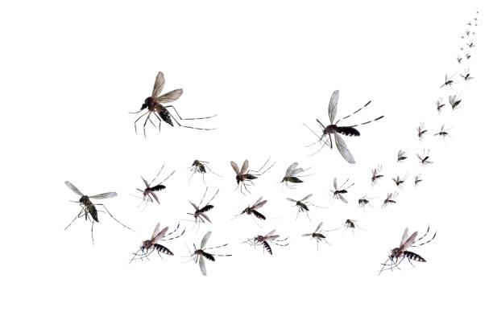

 <h1 style="text-align: center; font-size: 36px;">Dengue 2022 en Argentina</h1>

## Streamlit del Proyecto
Mediante el framework de python Streamlit, presento los datos del proyectos y las graficas en un entorno de Integracion Continua.

En este sitio web encontrara la documentacion y el desarrollo del proyecto, podrá manipular los datos visualizar los resultados 

[WebApp](https://diegomaneyro-dengue2022argentina-streamlitstreamlit-app-s1ebaa.streamlit.app/)

## Problematica

* El dengue es una enfermedad transmitida por mosquitos que representan importantes problemas de salud pública en muchas partes del mundo, incluyendo Argentina.
Esta enfermedad viral es transmitida por mosquitos del género Aedes, principalmente Aedes aegypti. Es endémico en áreas tropicales y subtropicales, y puede causar síntomas que van desde una fiebre leve hasta formas más graves que pueden llevar a complicaciones potencialmente mortales, como el dengue grave o el dengue hemorrágico. El dengue ha experimentado un aumento significativo en los últimos años y se considera un problema de salud pública en Argentina.

## Origen de los datos

[datos.gob.ar](https://www.datos.gob.ar/ca/)

## Descripcion
Este repositorio contiene el código y los recursos utilizados en el proyecto de investigación sobre la incidencia del dengue en Argentina. El objetivo de este proyecto es analizar los datos epidemiológicos y geoespaciales para comprender la propagación y los factores de riesgo de esta enfermedad en el país.

## Repositorio
* Readme: descripcion del proyecto
* Datos: Ubicacion de los datos originales descargados desde la web, tambien los archivos transformados y el analisis exploratorio
* Streamlit: Deploy de la Demo, uso el framework Streamlit para las visualizaciones tanto de los datos transformados como las distintas graficas construidas.
* Recuros: archivos multimedia del proyecto
 
## Deploy

- Streamlit
- Bibliotecas de Python especificadas en el archivo `requirements.txt`

## Licencia

Este proyecto se distribuye bajo la Licencia MIT. Puedes encontrar los términos y condiciones de la licencia en [este enlace](https://opensource.org/licenses/MIT).

